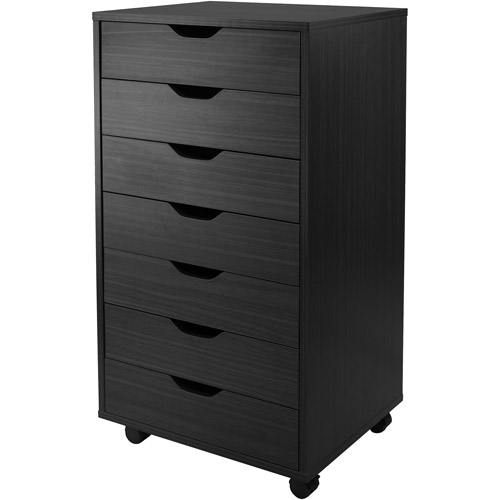

# Arrays1

Met arrays kun je de computer veel waardes laten onthouden:
de coordinaten van kogels, meteorieten, vijanden. 
Met een for loop kun je door een array heen gaan.

In deze les gaan we leren 

 * waarom je arrays nodig hebt
 * wat arrays zijn
 * hoe je arrays met een for loop gebruikt 

Zo gaat het eruit zien:


## Rooksimulator

Je bent bezig een simulatie te maken: je wilt allemaal 
rookdeeltjes laten bewegen op het scherm.

Dit is je code:

```
float x1 = 160;
float y1 = 100;
float x2 = 160;
float y2 = 100;

void setup() 
{
  size(320, 200);
}

void draw()
{
  x1 += random(-1,1);
  y1 += random(-1,1);
  ellipse(x1, y1, 10, 10);
  x2 += random(-1,1);
  y2 += random(-1,1);
  ellipse(x2, y2, 10, 10);
}
```

Dit is wat de code betekent:

 * `float x1 = 160`: 'Lieve computer, onthoudt een gebroken getal met de naam `x1`, met als beginwaarde 160'. Dit wordt de x coordinaat van het eerste rookdeeltje
 * `float y1 = 100`: 'Lieve computer, onthoudt een gebroken getal met de naam `y1`, met als beginwaarde 100'. Dit wordt de y coordinaat van het eerste rookdeeltje
 * `float x2 = 160`: 'Lieve computer, onthoudt een gebroken getal met de naam `x2`, met als beginwaarde 160'. Dit wordt de x coordinaat van het tweede rookdeeltje
 * `float y2 = 100`: 'Lieve computer, onthoudt een gebroken getal met de naam `y2`, met als beginwaarde 100'. Dit wordt de y coordinaat van het tweede rookdeeltje
 * `void setup() {}`: de klaarzet functie. Bij het opstarten wordt de code tussen de accolates een keer uitgevoerd
 * `size(320, 200)`: maak een venster van 320 pixels breed en 200 pixels hoog
 * `void draw() {}`: de teken functie. De code tussen de accolates wordt oneindig vaak uitgevoerd
 * `x1 += random(-1,1)`: verander de waarde van `x1` met een willekeurige waarden van -1 tot 1. Dit laat rookdeeltje 1 willekeurig horizontaal bewegen
 * `y1 += random(-1,1)`: verander de waarde van `y1` met een willekeurige waarden van -1 tot 1. Dit laat rookdeeltje 1 willekeurig verticaal bewegen
 * `ellipse(x1, y1, 10, 10)`: teken een ovaal met als middelpunt (`x1`, `y1`) met breedte 10 en hoogte 10. Teken het eerste rookdeeltje
 * `x2 += random(-1,1)`: verander de waarde van `x2` met een willekeurige waarden van -1 tot 1. Dit laat rookdeeltje 2 willekeurig horizontaal bewegen
 * `y2 += random(-1,1)`: verander de waarde van `y2` met een willekeurige waarden van -1 tot 1. Dit laat rookdeeltje 2 willekeurig verticaal bewegen
 * `ellipse(x2, y2, 10, 10)`: teken een ovaal met als middelpunt (`x2`, `y2`) met breedte 10 en hoogte 10. Teken het tweede rookdeeltje

## Vragen

 * Run deze code
 * Zorg dat er een derde rookdeeltje bijkomt
 * Hoeveel regels code kost het ongeveer om honderd rookdeeltjes te programmeren?

## Waarom arrays?

Dit is de code met drie rookdeeltjes:

```
float x1 = 160;
float y1 = 100;
float x2 = 160;
float y2 = 100;
float x3 = 160;
float y3 = 100;

void setup() 
{
  size(320, 200);
  x1 = 160;
  y1 = 100;
  x2 = 160;
  y2 = 100;
  x3 = 160;
  y3 = 100;
}

void draw()
{
  x1 += random(-1,1);
  y1 += random(-1,1);
  ellipse(x1, y1, 10, 10);
  x2 += random(-1,1);
  y2 += random(-1,1);
  ellipse(x2, y2, 10, 10);
  x3 += random(-1,1);
  y3 += random(-1,1);
  ellipse(x3, y3, 10, 10);
}
```

Het valt op dat er veel herhaling in zit.
Dit komt omdat we de computer steeds een getal tegelijk laten onthouden:
`float x1 = 160` betekent 'Lieve computer, onthoudt een gebroken getal met de naam `x1`, met als beginwaarde 160'.
Wat we willen kunnen zeggen is 'Lieve computer, onthoud keiveel gebroken getallen'.
Dit is precies wat een array kan doen.

## Wat is een array?

Een array kun je zien als een kast met laatjes:



Elk laatje heeft een nummer en in elk laatje kan een getal.

Hier zie je de nummers van de laatjes:


Het valt op dat het eerste laatje nummer *nul* heeft. 
Mensen beginnen vaak te tellen vanaf een, bij arrays telt
Processing vanaf nul.
De kast heeft zeven laatjes, met nummers nul tot en met zes.

## Werken met arrays

Stel we willen een array maken van gebroken getallen (`float`s) met de naam `geheime_getallen`, 
dan moeten we boven de `setup` het volgende typen:

```
float[] geheime_getallen;
```

Hiermee zeg je: 'Lieve computer, onthoud keiveel gebroken getallen met de naam `geheime_getallen`'.

Er is nog niet gezegd *hoeveel* gebroken getallen dat zijn.
Vaak wordt de `setup` functie gebruikt om te zeggen hoeveel getallen er onthouden moeten worden:

```
geheime_getallen = new float[7];
```

Hiermee zeg je: 'Lieve computer, maak `geheime_getallen` groot genoeg om zeven gebroken getallen (`float`s) te onthouden'.


```
int aantal_punten = 3;
float[] xs;
float[] ys;

void setup() 
{
  size(320, 200);
  xs = new float[aantal_punten];
  ys = new float[aantal_punten];
  for (int i=0; i!=aantal_punten; ++i)
  {
    ys[i] = 160;
    xs[i] = 100;
  }
}

void draw()
{
  for (int i=0; i!=aantal_punten; ++i)
  {
    xs[i] += random(-1,1);
    ys[i] += random(-1,1);
    ellipse(xs[i], ys[i], 10, 10);
  }
}
```


