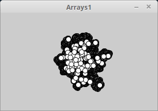
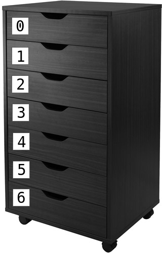

# Arrays1

Met arrays kun je de computer veel waardes laten onthouden:
de coordinaten van kogels, meteorieten, vijanden. 
Met een for loop kun je door een array heen gaan.

In deze les gaan we leren 

 * waarom je arrays nodig hebt
 * wat arrays zijn
 * hoe je arrays met een for loop gebruikt 

Zo gaat het eruit zien:



## Rooksimulator

Je bent bezig een simulatie te maken: je wilt allemaal 
rookdeeltjes laten bewegen op het scherm.

Dit is je code:

```
float x1 = 160;
float y1 = 100;
float x2 = 160;
float y2 = 100;

void setup() 
{
  size(320, 200);
}

void draw()
{
  x1 += random(-1,1);
  y1 += random(-1,1);
  ellipse(x1, y1, 10, 10);
  x2 += random(-1,1);
  y2 += random(-1,1);
  ellipse(x2, y2, 10, 10);
}
```

Dit is wat de code betekent:

 * `float x1 = 160`: 'Lieve computer, onthoudt een gebroken getal met de naam `x1`, met als beginwaarde 160'. Dit wordt de x coordinaat van het eerste rookdeeltje
 * `float y1 = 100`: 'Lieve computer, onthoudt een gebroken getal met de naam `y1`, met als beginwaarde 100'. Dit wordt de y coordinaat van het eerste rookdeeltje
 * `float x2 = 160`: 'Lieve computer, onthoudt een gebroken getal met de naam `x2`, met als beginwaarde 160'. Dit wordt de x coordinaat van het tweede rookdeeltje
 * `float y2 = 100`: 'Lieve computer, onthoudt een gebroken getal met de naam `y2`, met als beginwaarde 100'. Dit wordt de y coordinaat van het tweede rookdeeltje
 * `void setup() {}`: de klaarzet functie. Bij het opstarten wordt de code tussen de accolates een keer uitgevoerd
 * `size(320, 200)`: maak een venster van 320 pixels breed en 200 pixels hoog
 * `void draw() {}`: de teken functie. De code tussen de accolates wordt oneindig vaak uitgevoerd
 * `x1 += random(-1,1)`: verander de waarde van `x1` met een willekeurige waarden van -1 tot 1. Dit laat rookdeeltje 1 willekeurig horizontaal bewegen
 * `y1 += random(-1,1)`: verander de waarde van `y1` met een willekeurige waarden van -1 tot 1. Dit laat rookdeeltje 1 willekeurig verticaal bewegen
 * `ellipse(x1, y1, 10, 10)`: teken een ovaal met als middelpunt (`x1`, `y1`) met breedte 10 en hoogte 10. Teken het eerste rookdeeltje
 * `x2 += random(-1,1)`: verander de waarde van `x2` met een willekeurige waarden van -1 tot 1. Dit laat rookdeeltje 2 willekeurig horizontaal bewegen
 * `y2 += random(-1,1)`: verander de waarde van `y2` met een willekeurige waarden van -1 tot 1. Dit laat rookdeeltje 2 willekeurig verticaal bewegen
 * `ellipse(x2, y2, 10, 10)`: teken een ovaal met als middelpunt (`x2`, `y2`) met breedte 10 en hoogte 10. Teken het tweede rookdeeltje

## Vragen

 * Run deze code
 * Zorg dat er een derde rookdeeltje bijkomt
 * Hoeveel regels code kost het ongeveer om honderd rookdeeltjes te programmeren?

## Waarom arrays?

Dit is de code met drie rookdeeltjes:

```
float x1 = 160;
float y1 = 100;
float x2 = 160;
float y2 = 100;
float x3 = 160;
float y3 = 100;

void setup() 
{
  size(320, 200);
  x1 = 160;
  y1 = 100;
  x2 = 160;
  y2 = 100;
  x3 = 160;
  y3 = 100;
}

void draw()
{
  x1 += random(-1,1);
  y1 += random(-1,1);
  ellipse(x1, y1, 10, 10);
  x2 += random(-1,1);
  y2 += random(-1,1);
  ellipse(x2, y2, 10, 10);
  x3 += random(-1,1);
  y3 += random(-1,1);
  ellipse(x3, y3, 10, 10);
}
```

Het valt op dat er veel herhaling in zit.
Dit komt omdat we de computer steeds een getal tegelijk laten onthouden:
`float x1 = 160` betekent 'Lieve computer, onthoudt een gebroken getal met de naam `x1`, met als beginwaarde 160'.
Wat we willen kunnen zeggen is 'Lieve computer, onthoud keiveel gebroken getallen'.
Dit is precies wat een array kan doen.

## Wat is een array?

Een array kun je zien als een kast met laatjes:


Elk laatje heeft een nummer en in elk laatje kan een getal.

Hier zie je de nummers van de laatjes:



Het valt op dat het eerste laatje nummer *nul* heeft.
Je zegt: 'Het eerste laatje heeft index nul'. 
Als je normaal telt, begin je bij een.
Bij indices (het meervoud van index) begin je te tellen bij nul.
De kast heeft zeven laatjes, met indices nul tot en met zes.

## Vragen

 * Wat is een array?
 * Wat is een index?
 * Een array kan drie getallen bevatten. Wat zijn de indices?
 * Een array heeft als hoogste index `13`. Wat is de grootte van de array?
 * Een array kan 314 getallen bevatten. Wat is de hoogste index?
 * Een array heeft als hoogste index `0`. Wat is de grootte van de array?

## Werken met arrays

Stel we willen een array maken van gebroken getallen (`float`s) met de naam `geheime_getallen`, 
dan moeten we boven de `setup` het volgende typen:

```
float[] geheime_getallen;
```

Hiermee zeg je: 'Lieve computer, onthoud keiveel gebroken getallen met de naam `geheime_getallen`'.

Er is nog niet gezegd *hoeveel* gebroken getallen dat zijn.
Vaak wordt de `setup` functie gebruikt om te zeggen hoeveel getallen er onthouden moeten worden:

```
geheime_getallen = new float[7];
```

Hiermee zeg je: 'Lieve computer, maak `geheime_getallen` groot genoeg om zeven gebroken getallen (`float`s) te onthouden'.

Om de kast met de laatjes na te maken, kun je de volgende code gebruiken:

```
geheime_getallen[0] =  0;
geheime_getallen[1] =  1;
geheime_getallen[2] =  4;
geheime_getallen[3] =  9;
geheime_getallen[4] = 16;
geheime_getallen[5] = 25;
geheime_getallen[6] = 36;
```

Hiermee zeg je, in de derde regel: 'Lieve computer, stop in laatje met index twee het getal vier'.
Deze code zou prima in de `setup` functie gedaan kunnen worden.

Dit kan ook slimmer. Hieronder zie je code die *precies* hetzelfde doet:

```
for (int i=0; i!=7; ++i) 
{
  geheime_getallen[i] = i * i;
}
```

Hiermee zeg je: 'Lieve computer, laat een for loop lopen van nul tot zeven met `i` als teller. Stop in het `i`-de laatje het getal `i` keer `i`'.

Je zou ook de waarden in de laatjes kunnen lezen:

```
for (int i=0; i!=7; ++i) 
{
  float x = geheime_getallen[i];
  ellipse(x,200,300,400);
}
```

Hiermee zeg je: 'Lieve computer, laat een for loop lopen van nul tot zeven met `i` als teller. 
Kijk wat er in het `i`-de laatje zit en onthoud dat als `x`. 
Teken dan een ovaal die `x` pixels naar rechts is, 200 pixels omlaag is, 300 pixels breed is, en 400 pixels hoog is.'.

Alles bij elkaar krijg je dit programma:

```
float[] geheime_getallen;

void setup()
{
  size(400,400);
  geheime_getallen = new float[7];
  for (int i=0; i!=7; ++i) 
  {
    geheime_getallen[i] = i * i;
  }
}

void draw() 
{
  for (int i=0; i!=7; ++i) 
  {
    float x = geheime_getallen[i];
    ellipse(x,200,300,400);
  }
}
```

Dit programma ziet er niet erg mooi uit. Het is bedoeld om je te laten hoe je arrays maakt, vult en leest.

## Vragen

 * Welke foutmelding krijg je als je `float[] geheime_getallen;` in de `setup` functie zet?
 * Welke foutmelding krijg je als je `float geheime_getallen;` (dus zonder blokhaken) gebruikt?
 * Je wilt een array maken van gebroken getallen met de naam `snelheden`. Hoe zeg je dat in code?
 * Je hebt een array van gebroken getallen met de naam `schades`. Je wilt dat deze 345 groot wordt. Hoe zeg je dat in code?
 * Je hebt een array van gebroken getallen met de naam `roodwaarden` die 987 groot is. Je wilt alle `roodwaarden` op `128` zetten. Hoe doe je dat?
 * Je hebt een array van gebroken getallen met de naam `breedtes` die 345 groot is. Je wilt 345 ovalen tekenen, op `123` pixels naar rechts, `234` pixels omlaag, met een breedte van `breedtes` en een hoogte van `345`. Hoe doe je dat?

## Code met drie rookdeeltjes

Kijk naar de code met de drie rookdeeltjes:

```
float x1 = 160;
float y1 = 100;
float x2 = 160;
float y2 = 100;
float x3 = 160;
float y3 = 100;

void setup() 
{
  size(320, 200);
  x1 = 160;
  y1 = 100;
  x2 = 160;
  y2 = 100;
  x3 = 160;
  y3 = 100;
}

void draw()
{
  x1 += random(-1,1);
  y1 += random(-1,1);
  ellipse(x1, y1, 10, 10);
  x2 += random(-1,1);
  y2 += random(-1,1);
  ellipse(x2, y2, 10, 10);
  x3 += random(-1,1);
  y3 += random(-1,1);
  ellipse(x3, y3, 10, 10);
}
```

## Opdracht

 * Schrijf deze code om dat deze gebruik maakt van arrays
 * Verander de code zo dat er honderd rookdeeltjes kunnen zijn

## Oplossing

Hier de oplossing:

```
final int aantal_punten = 100;
float[] xs;
float[] ys;

void setup() 
{
  size(320, 200);
  xs = new float[aantal_punten];
  ys = new float[aantal_punten];
  for (int i=0; i!=aantal_punten; ++i)
  {
    xs[i] = 160;
    ys[i] = 100;
  }
}

void draw()
{
  for (int i=0; i!=aantal_punten; ++i)
  {
    xs[i] += random(-1,1);
    ys[i] += random(-1,1);
    ellipse(xs[i], ys[i], 10, 10);
  }
}
```

Dit doet de code:

 * `final int aantal_punten = 100`: 'Lieve computer, onthoud een heel getal (`int`), die ik `aantal_punten` noem, met beginwaarde 100, die ik nooit zal veranderen (`final`)
 * `float[] xs`: 'Lieve computer, onthoud een heleboel gebroken getallen (`float[]`), die ik `xs` noem'. Dit zijn de x-coordinaten (hoeveel pixels naar rechts) van de rookdeeltjes. 
 * `float[] ys`: 'Lieve computer, onthoud een heleboel gebroken getallen (`float[]`), die ik `ys` noem'. Dit zijn de y-coordinaten (hoeveel pixels omlaag)
 van de rookdeeltjes. 
 * `size(320, 200)`: maak het scherm 320 pixels breed en 200 pixels hoog
 * `xs = new float[aantal_punten]`: 'Lieve computer, maak `xs` groot genoeg om `aantal_punten` (dus 100) gebroken getallen (`float`s) te onthouden'
 * `ys = new float[aantal_punten]`: 'Lieve computer, maak `ys` groot genoeg om `aantal_punten` (dus 100) gebroken getallen (`float`s) te onthouden'

```
for (int i=0; i!=aantal_punten; ++i)
{
  xs[i] = 160;
  ys[i] = 100;
}
```

 * Laat een teller lopen van nul to `aantal_punten` (dus 100) in stapjes van een en noem het tellertje `i`. Zet de `i`-de `xs` op `160`. Zet de `i`-de `ys` op `100`.

```
for (int i=0; i!=aantal_punten; ++i)
{
  xs[i] += random(-1,1);
  ys[i] += random(-1,1);
  ellipse(xs[i], ys[i], 10, 10);
}
```

 * Laat een teller lopen van nul to `aantal_punten` (dus 100) in stapjes van een en noem het tellertje `i`. Verander de `i`-de `xs` willekeurig met -1, 0 of +1. Verander de `i`-de `ys` willekeurig met -1, 0 of +1. Teken een ellipse met de `i`-de `xs` naar rechts, de `i`-de `ys` omlaag, 10 pixels breed en 10 pixels hoog


